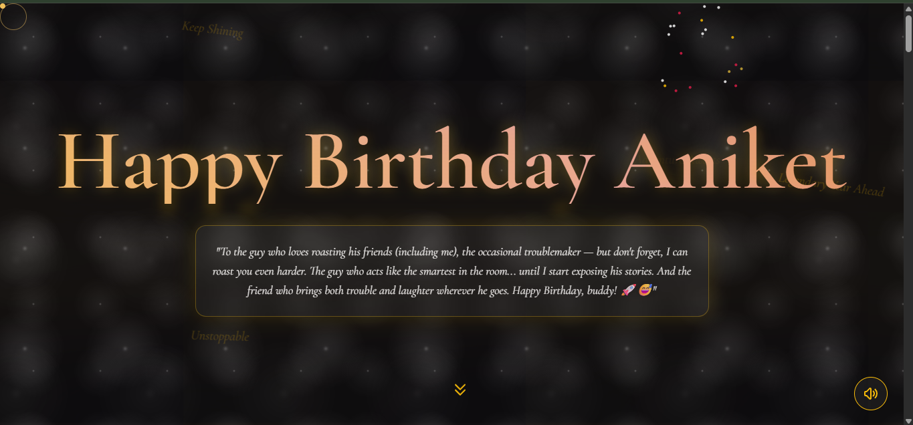
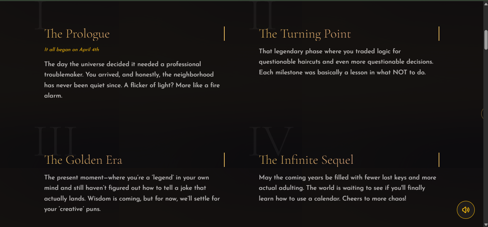
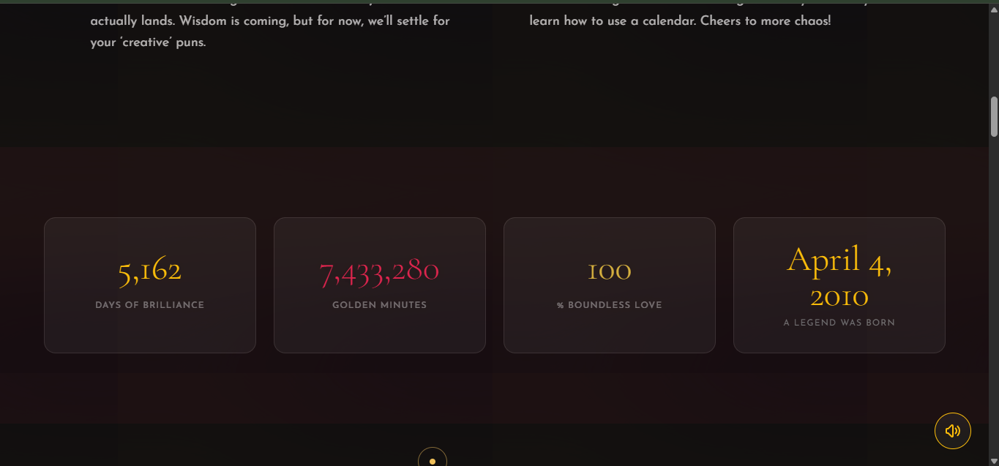
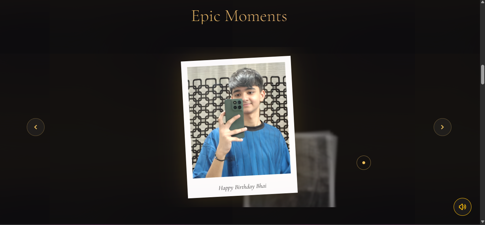
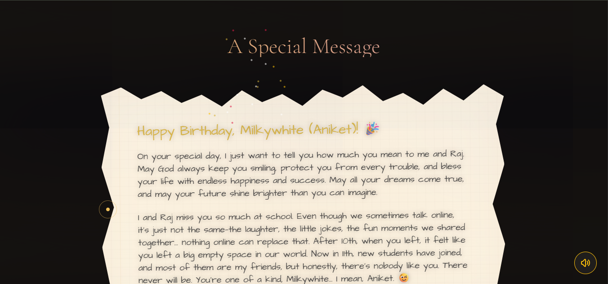
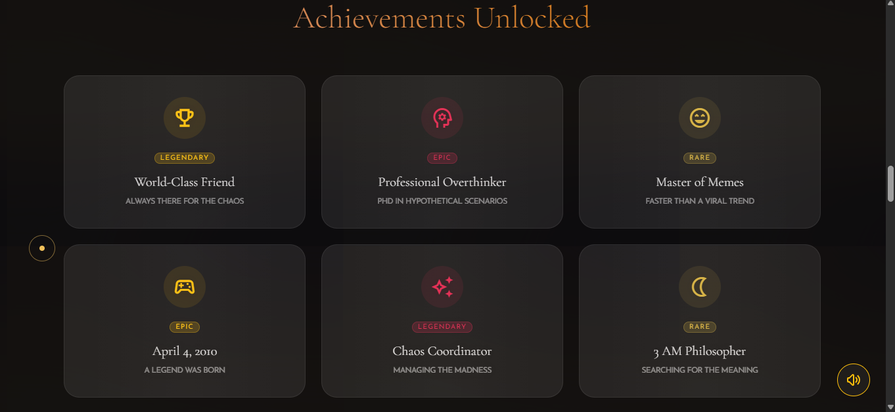
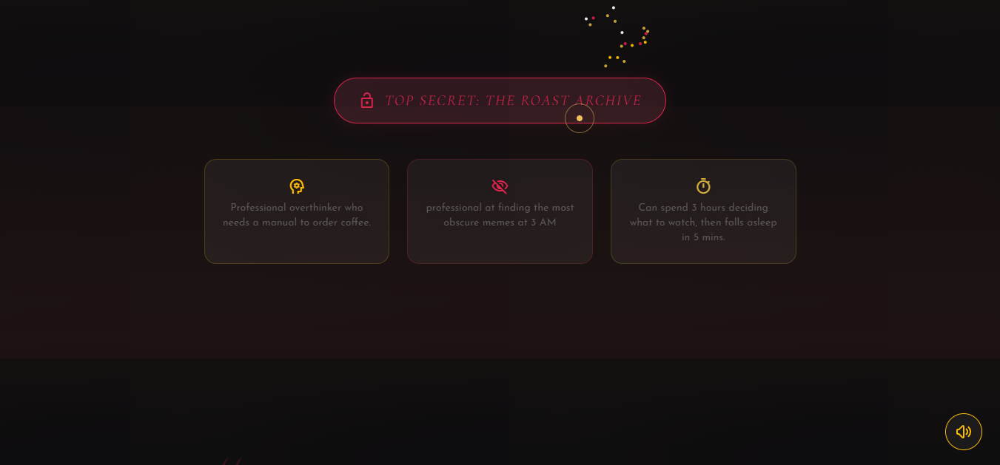
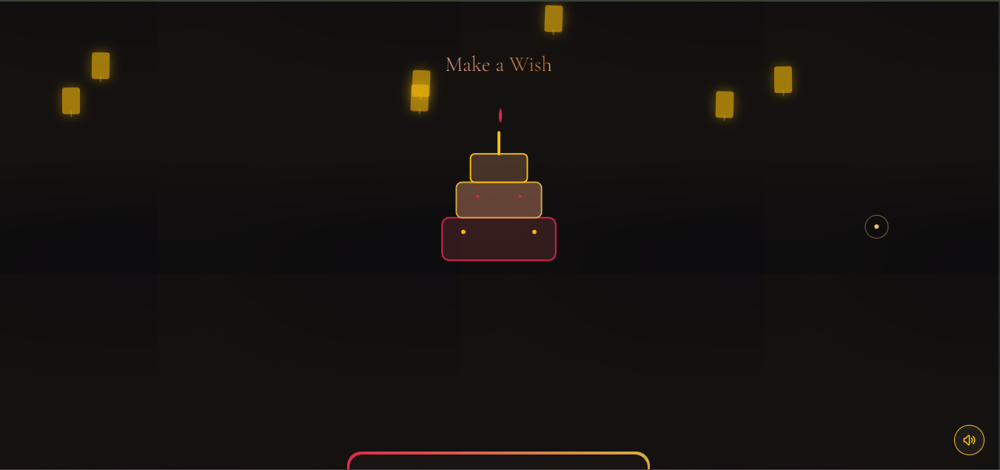
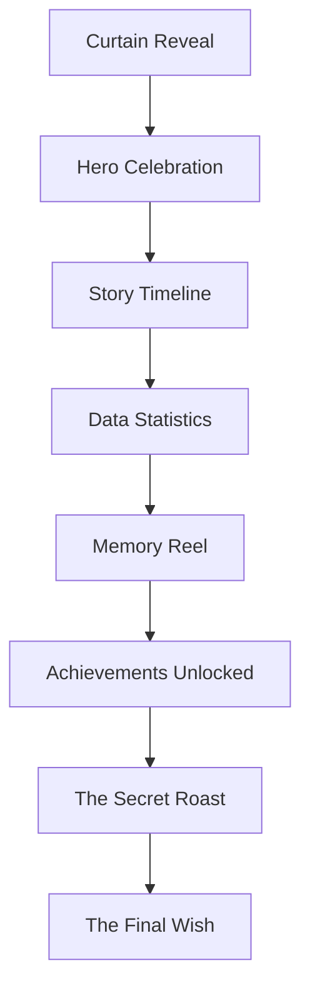

# 🎂 Aniket's Birthday Celebration: A Cinematic Legacy 🌟

**A high-fidelity, interactive experience designed to celebrate a legendary journey with style, humor, and heart.**

[🚀 View Live Demo](https://aadityashekhar321.github.io/Birthday/)

[Explore the Code](#️-getting-started) • [Jump to Features](#-the-experience) • [Customization](#️-customization-guide)

---

## 📌 Table of Contents
- [🎞️ Creative Showcase](#️-the-creative-showcase)
- [🎬 The Experience](#-the-experience)
- [🎨 Design & Technicals](#-technical-deep-dive)
- [⚙️ Customization Guide](#️-customization-guide)
- [🚀 Getting Started](#-getting-started)

---

## 🎞️ The Creative Showcase

A curated gallery capturing the energy, color, and chaos of this legendary celebration.

| | | |
| :---: | :---: | :---: |
|    **Phase 1**   *The Beginning* |    **Vibe Check**   *Pure Energy* |    **Details**   *Precision* |
|    **Unstoppable**   *No Limits* |    **THE HIGHLIGHT**   **EPIC MOMENT** |    **Golden Hour**   *Perfect Timing* |
|    **The Legacy**   *Timeless* |    **Finale**   *The Big Finish* | |

---

## 🎬 The Experience

The site is designed to feel like a vintage film premiere.

### 🎭 User Journey Flow

### ✨ Key Features at a Glance

| Feature | Description | Interaction |
| :--- | :--- | :--- |
| **🎥 Cinematic Intro** | Countdown with a 1.8s curtain opening animation. | Auto-start on load |
| **✨ Interactive Stars** | A parallax starfield that follows your mouse movement. | Mouse Hover |
| **🎆 Particle Bursts** | High-performance Canvas-based fireworks and sparkles. | Click Anywhere |
| **📸 Memory Reel** | A fluid, Polaroid-style photo gallery with smooth rotations. | Navigation Buttons |
| **🕵️ Roast Archive** | A hidden "Top Secret" vault containing playful roasts. | Toggle Button |
| **🎂 Animated Cake** | An SVG-drawn cake with flickering CSS flames. | Scroll Reveal |

---

<b>🛠️ Click to Expand: Technical Deep Dive</b>

### 🎨 Design System
- **Vintage Grained Overlay**: An animated film grain texture for a consistent, "analog" feel.
- **Glassmorphism UI**: High-end `backdrop-filter: blur()` effects with semi-transparent borders.
- **Dynamic Palette**: Warm **Amber**, **Rose**, and **Gold** gradients.

### 🧠 Core Mechanics
- **Canvas Particle System**: Custom JS engine managing physics-based `Particle` objects in real-time.
- **Intersection Observer API**: Sections reveal gracefully as you scroll, optimizing performance.
- **State Management**: Fluid transformations and card cycling handled via Vanilla JS.

<b>⚙️ Click to Expand: Customization Guide</b>

### 🖍️ Visuals & Data
- **Colors:** Find the `tailwind.config` section in `index.html` to change hex codes.
- **Messages:** Search for the quote text or journal message to edit the wishes.
- **Stats:** Locate the `counter` elements to update counts or the birthday date.

### 🖼️ Images
Simply replace the `src` URLs in the following sections:
- **Polaroids:** Find the `Memory Reel` section.
- **Gallery Images:** Replace `image1.png` to `image8.png` in the local folder.

---

## 🚀 Getting Started

### 1. Local View
1. Ensure `index.html` and your image assets are in the same folder.
2. Double-click `index.html` to launch.

### 2. Live Hosting (GitHub Pages)
1. Go to your repository settings on GitHub.
2. Navigate to **Pages**.
3. Select **main** branch and click **Save**.
4. Site will be live at `https://aadityashekhar321.github.io/Birthday/`!

---

## 📝 Credits
Crafted with meticulous attention to detail for **Aniket**.
- **Me & Raj**: For the heartfelt messages.
- **The Developers**: For bridging the gap between code and celebration.

---

### Give it a ⭐ if you liked it!

*May your code always compile and your birthday always be legendary!* 🚀

