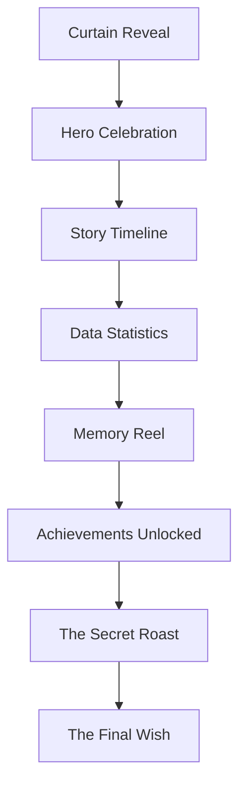

# 🎂 Aniket's Birthday Celebration: A Cinematic Legacy 🌟

**A high-fidelity, interactive experience designed to celebrate a legendary journey with style, humor, and heart.**

[Explore the Code](file:///c:/Users/HP/Downloads/Birthday/index.html) • [Jump to Features](#-the-experience) • [Technical Setup](#-getting-started)

---

## 📌 Table of Contents
- [🎞️ Creative Showcase](#️-the-creative-showcase)
- [🎬 The Experience](#-the-experience)
- [🎨 Design & Technicals](#-technical-deep-dive)
- [⚙️ Customization Guide](#️-customization-guide)
- [🚀 Getting Started](#-getting-started)

---

## 🎞️ The Creative Showcase

A curated gallery capturing the energy, color, and chaos of this legendary celebration.

| | | |
| :---: | :---: | :---: |
|    **Phase 1**   *The Beginning* |    **Vibe Check**   *Pure Energy* |    **Details**   *Precision* |
|    **Unstoppable**   *No Limits* |    **THE HIGHLIGHT**   **EPIC MOMENT** |    **Golden Hour**   *Perfect Timing* |
|    **The Legacy**   *Timeless* |    **Finale**   *The Big Finish* | |

---

## 🎬 The Experience

The site is designed to feel like a vintage film premiere.

### 🎭 User Journey Flow

### ✨ Key Features at a Glance

| Feature | Description | Interaction |
| :--- | :--- | :--- |
| **🎥 Cinematic Intro** | Countdown with a 1.8s curtain opening animation. | Auto-start on load |
| **✨ Interactive Stars** | A parallax starfield that follows your mouse movement. | Mouse Hover |
| **🎆 Particle Bursts** | High-performance Canvas-based fireworks and sparkles. | Click Anywhere |
| **📸 Memory Reel** | A fluid, Polaroid-style photo gallery with smooth rotations. | Navigation Buttons |
| **🕵️ Roast Archive** | A hidden "Top Secret" vault containing playful roasts. | Toggle Button |
| **🎂 Animated Cake** | An SVG-drawn cake with flickering CSS flames. | Scroll Reveal |

---

## ⚙️ Customization Guide

Want to change the messages or images? It's all in `index.html`.

### 🖍️ Visuals & Data
- **Colors:** Find the `tailwind.config` section (lines 13-28) to change the `amber`, `rose`, or `gold` hex codes.
- **Messages:** Search for the quote text or the journal message to edit the birthday wishes.
- **Stats:** Locate the `counter` elements (lines 450-469) to update the "Days of Brilliance" or birthday date.

### 🖼️ Images
Simply replace the `src` URLs in the following sections:
- **Polaroids:** Find the `Memory Reel` section (lines 471-509).
- **Gallery Images:** Replace `image1.png` to `image8.png` in the local folder.

---

## 🛠️ Technical Deep Dive

- **Vintage Style:** Animated film grain texture overlay.
- **Modern Foundation:** Built with Tailwind CSS and Vanilla JavaScript.
- **Performance:** Optimized with Intersection Observer API for smooth scrolling.

---

## 🚀 Getting Started

### 1. Local View
1. Ensure `index.html` and your image assets are in the same folder.
2. Double-click `index.html` to launch.

### 2. Live Hosting (GitHub Pages)
1. Go to your repository settings on GitHub.
2. Navigate to **Pages**.
3. Select **main** branch and click **Save**.
4. Site will be live at `https://aadityashekhar321.github.io/Birthday/`!

---

## 📝 Credits
Crafted to celebrate **Aniket**.
- **Me & Raj**: For the heartfelt messages.
- **The Developers**: For bridging the gap between code and celebration.

---

*May your code always compile and your birthday always be legendary!* 🚀

