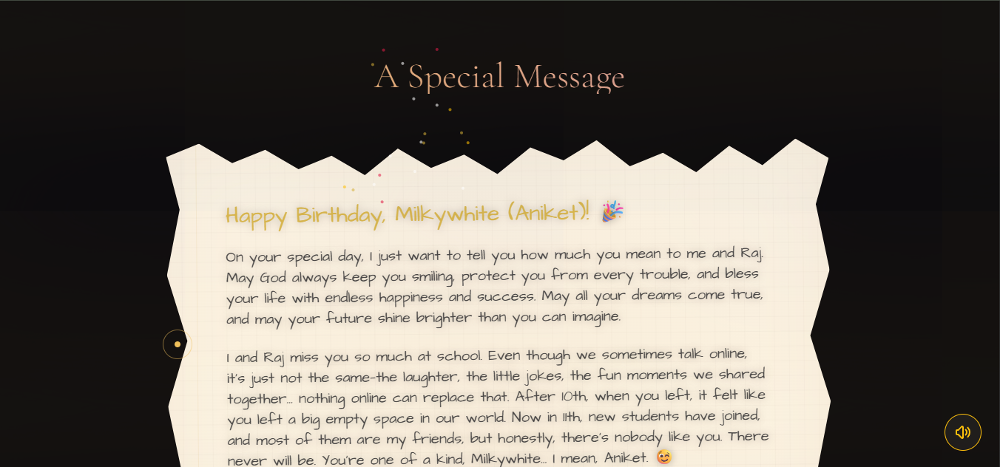
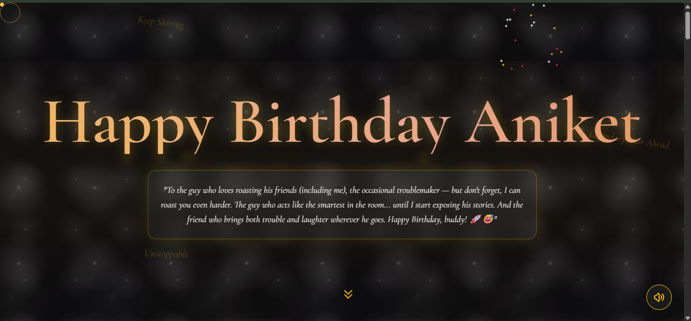
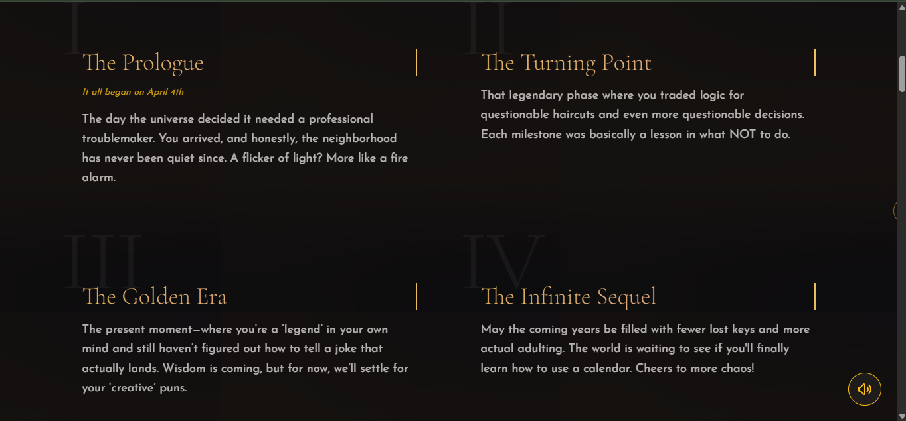
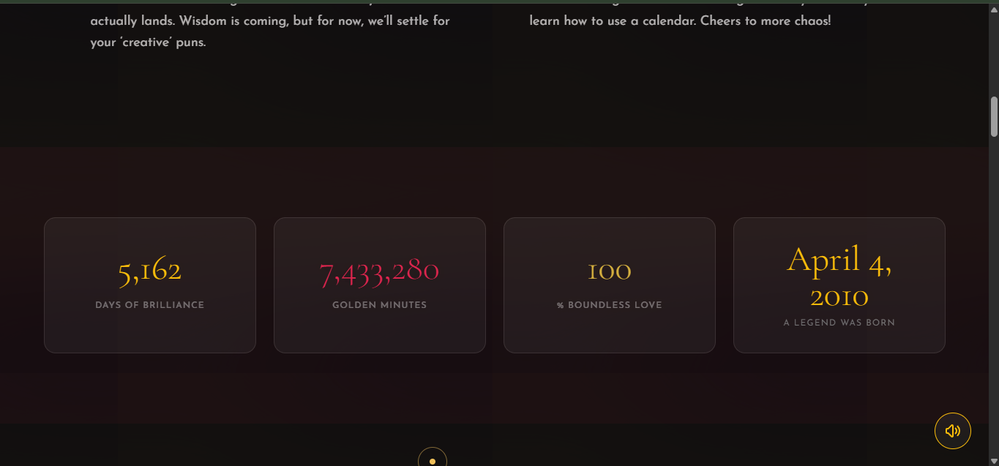
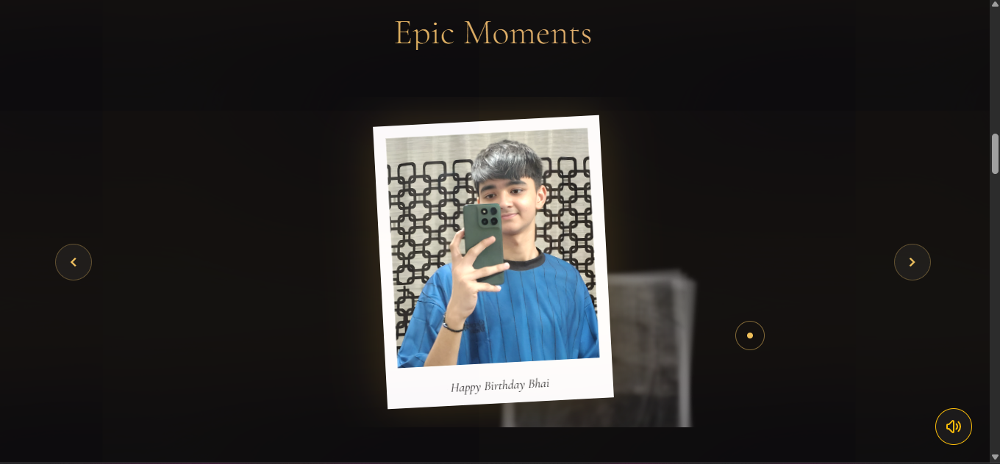
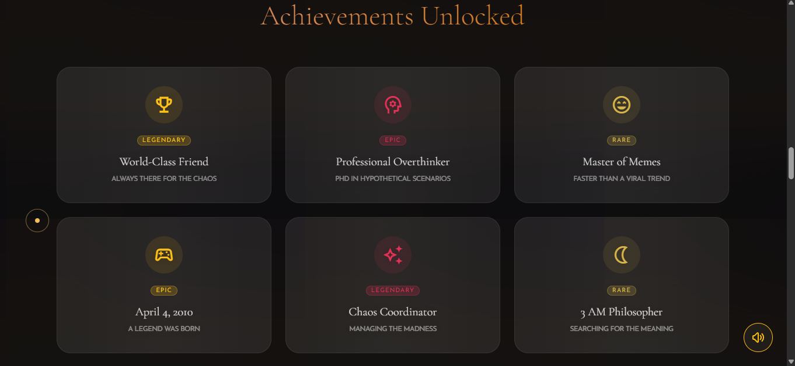
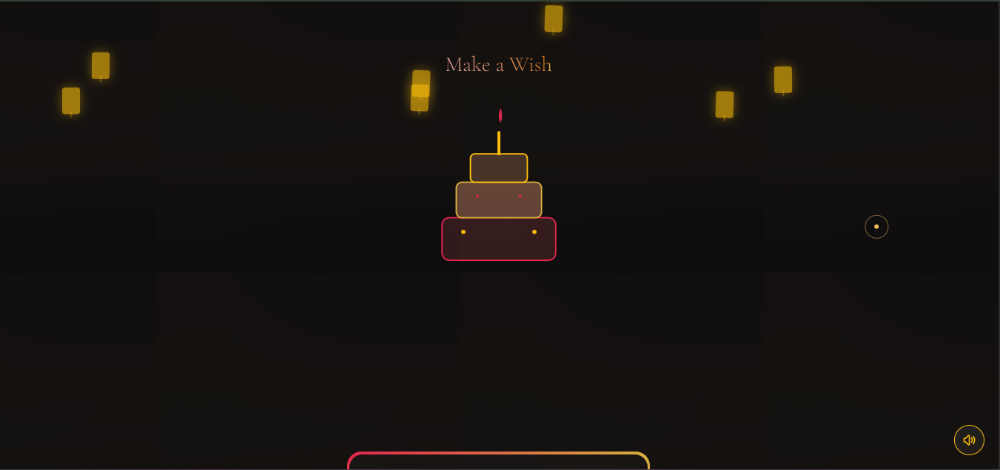
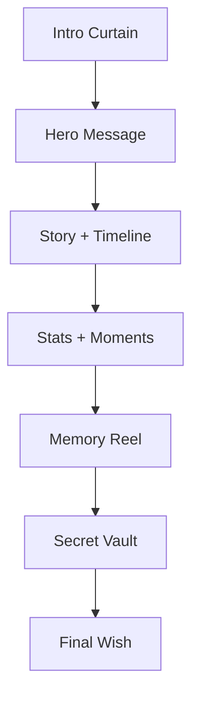

# 🎂 Birthday Cinematic Experience

### A stylish, interactive birthday microsite with cinematic visuals, playful storytelling, and smooth animations.

[🌐 Live Demo](https://aadityashekhar321.github.io/Birthday/) • [✨ Highlights](#-highlights) • [🛠️ Customize](#️-customize) • [🚀 Run Locally](#-run-locally)

---

## 🎞️ Visual Preview

  

 

| Scene 1 | Scene 2 | Scene 3 |
| :--: | :--: | :--: |
|  |  |  |
|  |  |  |

---

## ✨ Highlights

- 🎬 **Cinematic intro sequence** with curtain-style reveal and dramatic transitions.
- 🌌 **Interactive parallax starfield** reacting to user movement.
- 🎆 **Canvas-powered particle effects** for celebration moments.
- 🖼️ **Polaroid memory reel** with animated card transitions.
- 🕵️ **Secret roast vault** for fun hidden content.
- 🎂 **Animated celebration sections** with reveal-on-scroll interactions.

---

## 🧠 Experience Flow

```mermaid
graph TD
    A[Intro Curtain] --> B[Hero Message]
    B --> C[Story + Timeline]
    C --> D[Stats + Moments]
    D --> E[Memory Reel]
    E --> F[Secret Vault]
    F --> G[Final Wish]
```

---

## 🎨 Design + Tech

| Area | Details |
| --- | --- |
| **Visual Language** | Film grain overlay, glow text, glassmorphism cards, warm gold/rose palette |
| **Animation** | CSS keyframes + JS-triggered reveal effects + smooth transitions |
| **Interactivity** | Mouse-reactive effects, card navigation, hidden toggles |
| **Core Stack** | `index.html` + Tailwind CDN + vanilla JavaScript (no build tools) |

---

## ⚙️ Customize

1. **Update colors** in the `tailwind.config` section inside `index.html`.
2. **Edit birthday text/messages** directly in the same file.
3. **Replace images** by swapping `image1.png` to `image8.png` in the project root.
4. **Adjust animation intensity** by tweaking CSS keyframes and transition timings.

---

## 🚀 Run Locally

Because this is a static project, setup is instant:

1. Keep `index.html` and image files in the same directory.
2. Open `index.html` in a browser.

Optional (VS Code): use **Live Server** for auto-reload while editing.

---

## 🌍 Deploy on GitHub Pages

1. Open repository **Settings** → **Pages**.
2. Set source to `main` branch.
3. Save, then access:
   `https://aadityashekhar321.github.io/Birthday/`

---

## 📝 Credits

- Created for a special birthday celebration experience.
- Built with love, humor, and dramatic vibes.

---

  <h3>⭐ If this made you smile, drop a star!</h3>
  
<i>May your birthdays stay legendary and your builds stay green.</i>

