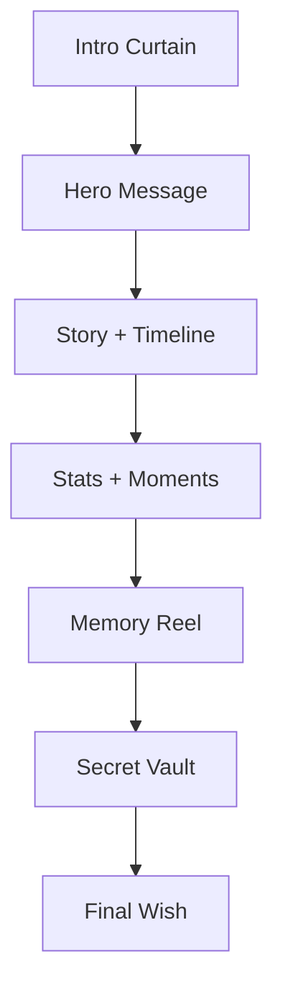

# 🎂 Birthday Cinematic Experience

### A dramatic, interactive birthday web experience with cinematic transitions, visual storytelling, and playful surprises.

[🌐 Live Demo](https://aadityashekhar321.github.io/Birthday/) • [✨ Highlights](#highlights) • [🛠️ Customization](#customization) • [🚀 Quick Start](#quick-start) • [🧭 Roadmap](#customization-map)

> “Designed like a celebration trailer. Delivered like a memory.”

---

## 📌 Table of Contents

- [🎞️ Visual Preview](#visual-preview)
- [✨ Highlights](#highlights)
- [🧠 Experience Flow](#experience-flow)
- [🎨 Design + Tech](#design--tech)
- [⚙️ Customization](#customization)
- [🚀 Quick Start](#quick-start)
- [🧭 Customization Map](#customization-map)
- [🌍 Deploy on GitHub Pages](#deploy-on-github-pages)
- [🤝 Contribution Notes](#contribution-notes)

---

## 🎞️ Visual Preview

  

 

| Sequence A | Sequence B | Sequence C |
| :--: | :--: | :--: |
|  |  |  |
|  |  |  |

---

## ✨ Highlights

| Feature | What it adds |
| --- | --- |
| 🎬 **Cinematic Intro** | Starts with a reveal-style opening for a dramatic first impression |
| 🌌 **Parallax Starfield** | Creates depth and motion by responding to cursor movement |
| 🎆 **Particle Bursts** | Adds celebratory visual effects for interaction moments |
| 🖼️ **Memory Reel** | Showcases photos with polaroid-style animated transitions |
| 🕵️ **Secret Vault** | Includes hidden playful content for discoverability |
| 🎂 **Reveal Animations** | Uses scroll-triggered section entrances for smooth storytelling |

---

## 🧠 Experience Flow

```mermaid
graph TD
    A[Intro Curtain] --> B[Hero Message]
    B --> C[Story + Timeline]
    C --> D[Stats + Moments]
    D --> E[Memory Reel]
    E --> F[Secret Vault]
    F --> G[Final Wish]
```

---

## 🎨 Design + Tech

| Area | Details |
| --- | --- |
| **Visual Language** | Film grain texture, glow accents, glassmorphism cards, warm gold/rose styling |
| **Animation Layer** | CSS keyframes + JavaScript-triggered reveal transitions |
| **Interaction Model** | Cursor-responsive effects, card navigation, hidden toggles |
| **Architecture** | Single-page static file (`index.html`) with local assets |
| **Dependencies** | Tailwind via CDN + browser-native JavaScript APIs |

---

## ⚙️ Customization

1. **Theme colors** → edit `tailwind.config` in `index.html`.
2. **Text content/messages** → update the relevant sections in `index.html`.
3. **Image set** → replace `image1.png` through `image8.png` in the project root.
4. **Animation feel** → tune keyframe values, durations, and easing in CSS.

---

## 🚀 Quick Start

This project is static and zero-install.

1. Keep `index.html` and image assets in the same folder.
2. Open `index.html` in your browser.
3. (Optional) Use VS Code **Live Server** for auto-refresh during edits.

---

## 🧭 Customization Map

| Goal | Where to edit |
| --- | --- |
| Change color palette | `tailwind.config` inside `index.html` |
| Rewrite birthday messages | Text blocks inside `index.html` |
| Replace gallery visuals | `image1.png` to `image8.png` in root |
| Modify motion style | CSS `@keyframes` + transition declarations in `index.html` |
| Adjust interactive behavior | JavaScript sections in `index.html` |

---

## 🌍 Deploy on GitHub Pages

1. Open repository **Settings** → **Pages**.
2. Set source to `main` branch.
3. Save and visit:  
   `https://aadityashekhar321.github.io/Birthday/`

---

## 🤝 Contribution Notes

- Keep edits lightweight and visual-first.
- Preserve the cinematic style language across sections.
- Prefer small iterations and test in browser after each change.

---

## 📝 Credits

- Built for a special birthday celebration.
- Crafted with humor, visuals, and dramatic vibes.

---

  <h3>⭐ If this made you smile, drop a star!</h3>
  
<i>May your birthdays stay legendary and your builds stay green.</i>

